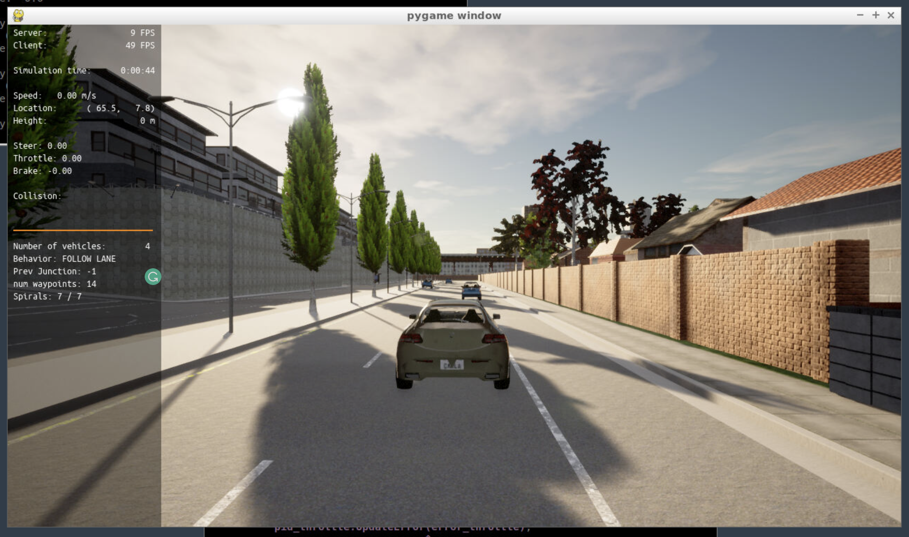
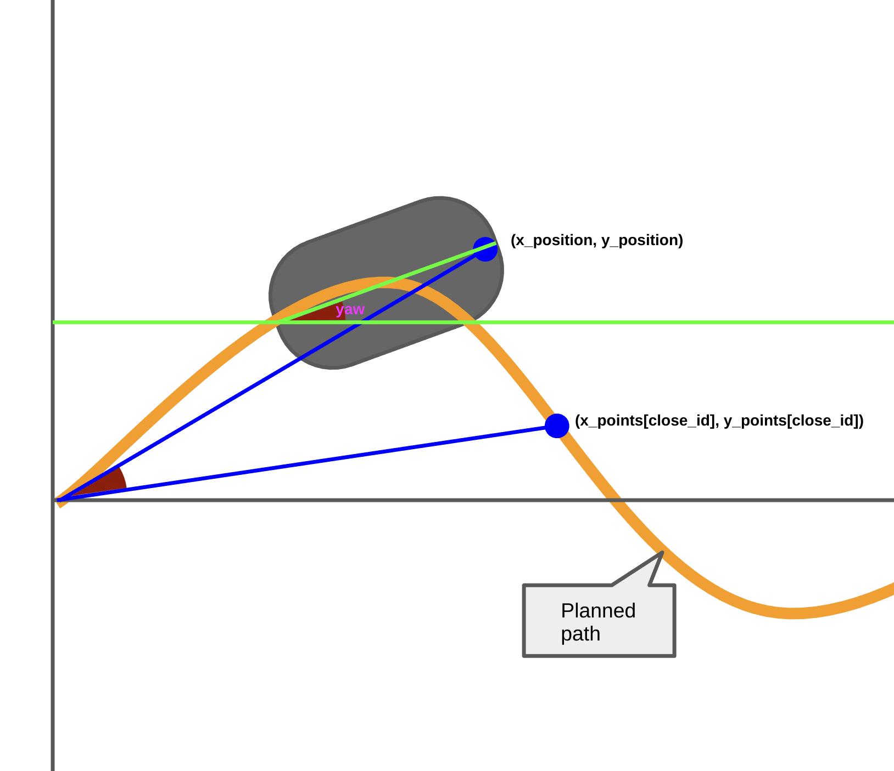

# Step 1: Build the PID controller object
Take a screenshot and add it to your report. The car should not move in the simulation.

# Step 2: PID controller for throttle:
The car should have the higher velocity than the velocity at next point of the planned path 
[Comment](https://github.com/kimbring2/nd013-c6-control-starter/blob/8b4f6fbf70fc8b0fe980d34b8ef685dae77e9229/project/pid_controller/main.cpp#L355)

# Step 3: PID controller for steer:
The car should steer it's direction based on the yaw angle of car and the angle of current position and next point of the planned path.

[Comment](https://github.com/kimbring2/nd013-c6-control-starter/blob/8b4f6fbf70fc8b0fe980d34b8ef685dae77e9229/project/pid_controller/main.cpp#L318)

# Step 4: Evaluate the PID efficiency
## 1. Add the plots to your report and explain them (describe what you see)
First, I fix the parameter for the PID controller of the throttle as (0.20, 0.001, 0.50, 1.2, -1.2 / Kpi, Kii, Kdi, output_lim_maxi, output_lim_mini) for easy analyzing. 

## 1) 0.01, 0.01, 0.01, 1.2, -1.2 / Kpi, Kii, Kdi, output_lim_maxi, output_lim_mini

## 2) 0.05, 0.01, 0.01, 1.2, -1.2

## 3) 0.20, 0.01, 0.01, 1.2, -1.2

## 4) 0.20, 0.005, 0.01, 1.2, -1.2

## 5) 0.20, 0.0025, 0.01, 1.2, -1.2

## 6) 0.20, 0.001, 0.01, 1.2, -1.2

## 7) 0.20, 0.001, 0.05, 1.2, -1.2

## 8) 0.20, 0.001, 0.1, 1.2, -1.2

## 9) 0.20, 0.001, 0.25, 1.2, -1.2

## 9) 0.20, 0.001, 0.50, 1.2, -1.2

2. What is the effect of the PID according to the plots, how each part of the PID affects the control command?
3. How would you design a way to automatically tune the PID parameters?
4. PID controller is a model free controller, i.e. it does not use a model of the car. Could you explain the pros and cons of this type of controller?
5. (Optional) What would you do to improve the PID controller?
