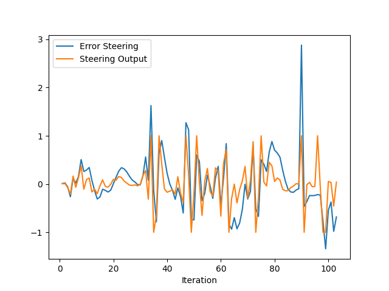
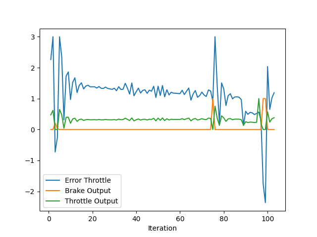

# Step 1: Build the PID controller object

# Step 2: PID controller for throttle:

# Step 3: PID controller for steer:

# Step 4: Evaluate the PID efficiency

1. Add the plots to your report and explain them (describe what you see)
2. What is the effect of the PID according to the plots, how each part of the PID affects the control command?
3. How would you design a way to automatically tune the PID parameters?
4. PID controller is a model free controller, i.e. it does not use a model of the car. Could you explain the pros and cons of this type of controller?
5. (Optional) What would you do to improve the PID controller?
